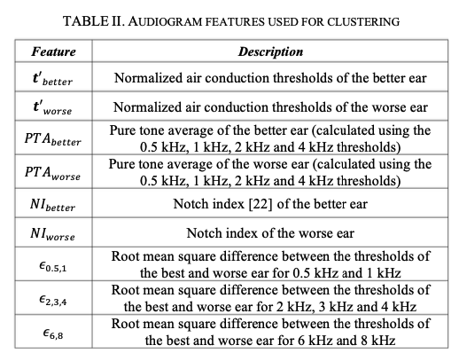
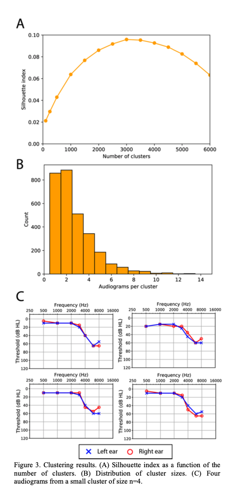
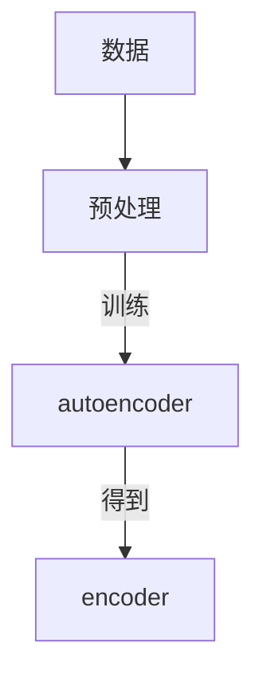
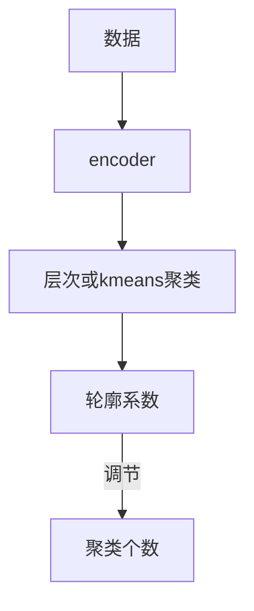
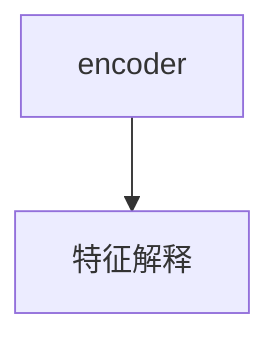

# hearing-loss

### 参考论文

Mining Audiograms to Improve the Interpretability of Automated Audiometry Measurements

#### 听力图处理

- 首先，我们丢弃了所有不完整的听力图，其中至少有一个测试频率缺失。
- 接下来，我们丢弃了双耳听力都在正常范围内的听力图。根据对美国言语-语言-听力协会(ASHA)听力损失指南的共同解释，我们认为所有阈值分别小于或等于20 dB和15 dB的听力图分别表示成人和儿童的听力正常
- 假设在非测试耳中没有任何掩蔽噪声的情况下获得阈值，则难以确定两耳之间的大阈值差异是真实的还是反映了测量误差。因此，我们采用了一种保守的质量控制策略，并丢弃了两耳间出现2个或更多阈值差异超过50 dB的听力图。
- 如果所有残差都在10 dB以内，则根据它们的斜率(表1)对它们进行分类。双耳可被归入其中一个类别的听力图被认为价值较低，因为它们很容易用现有规则进行分类。我们提出的监督学习方法适用于模糊听力图的分类，这些模糊听力图不能使用这些简单的规则进行分类。这些听力图就这样被搁置了。然而，我们确实对一些**“琐碎的**”听力图进行了采样，以确定听力学家是否一致地再现了应用这些规则所得到的注释。
- *找一些琐碎的pattern，做更细粒度助听器自适配。*

### 使用聚类来对听力图进行分析

听力图使用阈值本身作为特征，在逐个耳朵的基础上进行聚类，并**完全忽略对称性**。

其他研究未能分离听力图的形状和严重程度，这种做法将形状相同但严重程度不同的听力图指定为高度不相似。鉴于我们的目标是创建一个关于**形状、严重程度和对称性**的听力图异质样本，我们提取了一组不同于这些典型表征的特征。

我们的听力图表示考虑双耳。我们根据平均阈值将耳朵从**“左”和“右”重新标记为“更好”和“更差”**，以确保阈值所属的耳朵(“左”或“右”)对集群成员没有影响。

**人工特征**

我们采用了**数据驱动的方法**，依靠**听力图之间的内在相似性来近似簇的自然数**。我们使用平均轮廓系数[23]作为聚类质量的指标。

应用凝聚层次聚类，使用平均轮廓指数作为目标函数，来确定我们的非平凡听力图集中聚类的自然数量。

**可以在聚类指标上做一些自己的设计，作为创新点。**

### pipeline

